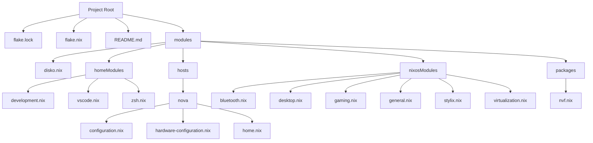

This is my personal [NixOS](https://nixos.org/) configuration.

## Framework ##
My config is structured using the [Dendritic Pattern](https://github.com/mightyiam/dendritic), which is powered mainly by [flake-parts](https://flake.parts/).

## Structure ##

```mermaid
graph TD
    Flake[Flake] --> DC[diskoConfigurations]
    DC --> hostNova[hostNova: Disko module]

    Flake --> HC[homeConfigurations]
    HC --> hm[home-manager: Home Manager configuration]

    Flake --> HM[homeModules]
    HM --> vscode[vscode: Home Manager module]
    HM --> zsh[zsh: Home Manager module]
    HM --> dev[development: Home Manager module]

    Flake --> NC[nixosConfigurations]
    NC --> nova[nova: NixOS configuration]

    Flake --> NM[nixosModules]
    NM --> blue[bluetooth: NixOS module]
    NM --> desk[desktop: NixOS module]
    NM --> game[gaming: NixOS module]
    NM --> gen[general: NixOS module]
    NM --> hwNova[hardwareNova: NixOS module]
    NM --> hKyle[homeKyle: NixOS module home-manager]
    NM --> hstNova[hostNova: NixOS module]
    NM --> stylix[stylix: NixOS module]
    NM --> virt[virtualization: NixOS module]

    Flake --> PKG[packages]
    PKG --> x86[x86_64-linux]
    x86 --> nvim[neovim: package nvf-with-helpers]
```

